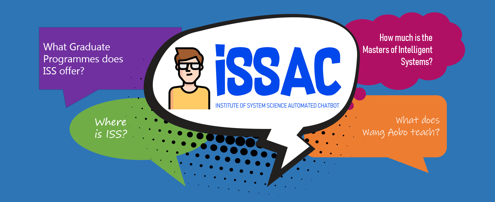
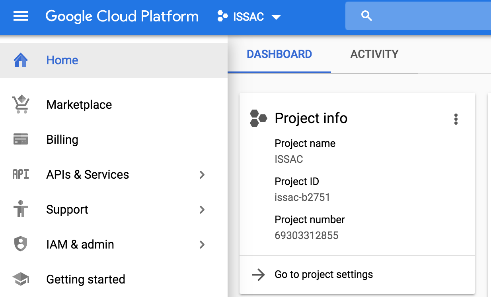
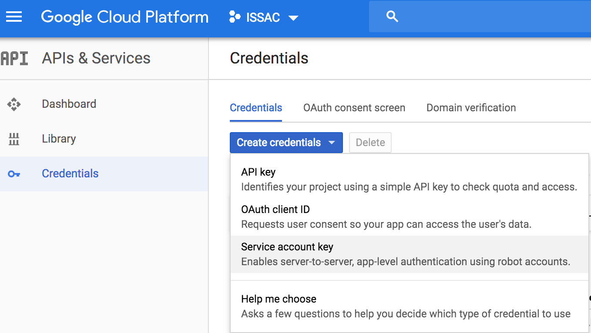
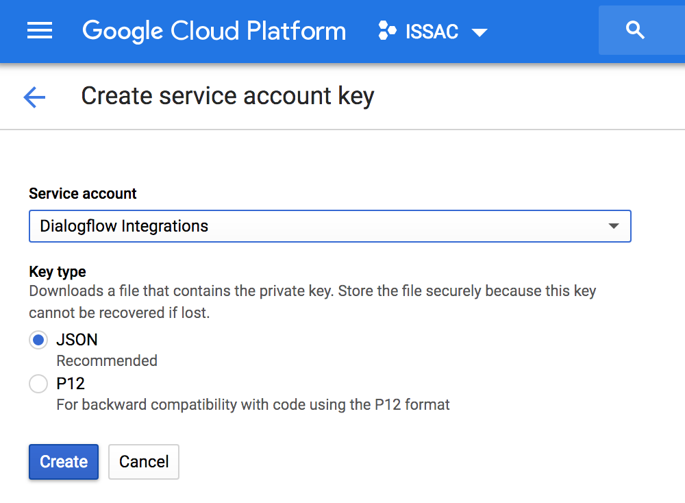
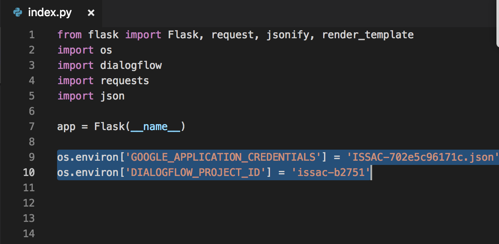
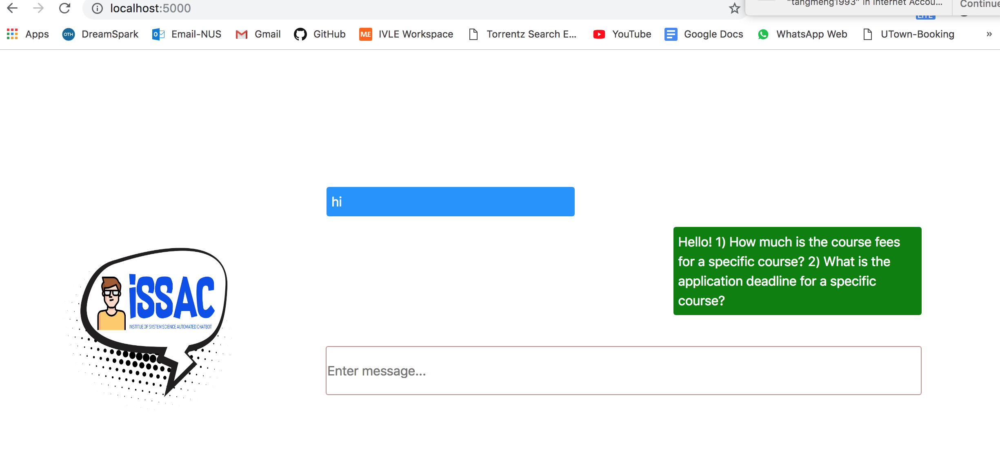

## SECTION 1 : PROJECT TITLE
## ISSAC: Institute of System Science Automated Chatbot

---
## SECTION 2 : EXECUTIVE SUMMARY

ISSAC is the implementation of an Automated Chatbot to provide information about the Institute of System Science (ISS) of the National University of Singapore. The key challenge was to identify key information contained with the website and extracting the relevant information from the website. Information Extraction (IE) techniques were applied to the website to summarize natural language text into a structured set of facts. We developed a framework for plugging in and executing IE methods over 150 pages in the ISS website. We also integrated a generic web crawler in the system.

---
## SECTION 3 : CREDITS / PROJECT CONTRIBUTION

| Official Full Name  | Student ID  | Work Items | 
| :------------ |:---------------:| :-----| 
| Tan Jun Khiang | A0195169N | Project Report, Information Extraction, Video| 
| Tan Wei Lian | A0048135J | Python Application - Backend Fulfilment|
| Tang Meng | A0137099U | Flask Web Application |
| Leong Jun Hun, Darryl | A0195318X | Information Extraction, Project Report| 

---
## SECTION 4 : VIDEO OF SYSTEM MODELLING & USE CASE DEMO

---
## SECTION 5 : USER GUIDE

`<Github File Link>` : <https://github.com/musicrokr/IRS-CS-2019-03-09-IS01PT-GRP-TheSundayLunatics-ISSAC/blob/master/UserGuide/ISSAC%20User%20Guide.pdf>

### [ 1 ] To run the system using iss-vm

> download pre-built virtual machine from http://bit.ly/iss-vm

> start iss-vm

> open terminal in iss-vm

> $ git clone https://github.com/musicrokr/IRS-CS-2019-03-09-IS01PT-GRP-TheSundayLunatics-ISSAC.git

> $ cd folder_location/SystemCode/issac-backend

> $ py -m venv env

> $ env\Scripts\activate

> $ pip install -r requirements.txt

> $ python main.py

> Download ngrok from https://ngrok.com/

> Run ngrok on http port 8080

### [ 2 ] To run the system in other/local machine:
### Install additional necessary libraries. This application works in Python 3 only.

> $ git clone https://github.com/musicrokr/IRS-CS-2019-03-09-IS01PT-GRP-TheSundayLunatics-ISSAC.git

> $ cd folder_location/SystemCode/issac-backend

> $ py -m venv env

> $ env\Scripts\activate

> $ pip install -r requirements.txt

> $ python main.py

> Download ngrok from https://ngrok.com/

> Run ngrok on http port 8080

### Run Frontend Application

> Start backend server first

> Import dialogflow project from /SystemCode/ISSAC.zip

> Go to Google Cloud Platform https://console.cloud.google.com/home/dashboard

> Select ISSAC project name: ISSAC

> Copy out the project_id. e.g issac-b2751

> Go to APIs & Services then Credentials

> Under Create credentials, click on Service account key

> Select Dialogflow integrations under Service account.

> Then select JSON under key type, click create

> Copy the downloaded JSON file ( ISSAC-*.json) to the root folder of the project - ISSAC

>Replace GOOGLE_APPLICATION_CREDENTIALS and DIALOGFLOW_PROJECT_ID in index.py

>$ cd folder_location/SystemCode/issac-frontend

>$ pip install dialogflow

>$ pip install flask

>$ python index.py

> Go to browser, type localhost:5000

---
## SECTION 6 : PROJECT REPORT / PAPER

`<Github File Link>` : <https://github.com/musicrokr/IRS-CS-2019-03-09-IS01PT-GRP-TheSundayLunatics-ISSAC/blob/master/ProjectReport/ISSAC%20Project%20Report.pdf>

---
## SECTION 7 : MISCELLANEOUS

N.A.

---

---

**This Cognitive Systems (CS) course is part of the Analytics and Intelligent Systems and Graduate Certificate in [Intelligent Reasoning Systems (IRS)](https://www.iss.nus.edu.sg/stackable-certificate-programmes/intelligent-systems "Intelligent Reasoning Systems") series offered by [NUS-ISS](https://www.iss.nus.edu.sg "Institute of Systems Science, National University of Singapore").**

**Lecturer: [GU Zhan (Sam)](https://www.iss.nus.edu.sg/about-us/staff/detail/201/GU%20Zhan "GU Zhan (Sam)")**

**zhan.gu@nus.edu.sg**
